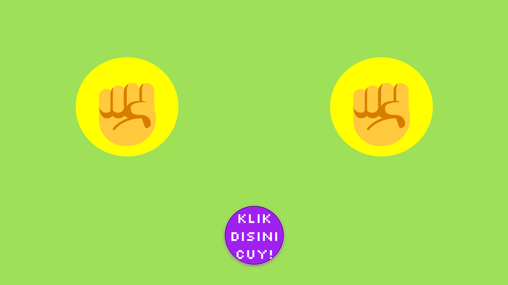

# Hi, everyone! 👋

This is our Final Project for the DevOps (A) class. This Final DevOps Project aims to build a pipeline that allows appearance changes to the Rock Paper Scissors application to be deployed automatically.

## Introducing our team!
- Ihsan Kamil Al Ghozi - 5026211117 | <a href="https://github.com/Deceitfulz">Github</a>
- Evanriza Safiq Ariadi - 5026211139 | <a href="https://github.com/EvanrizaSA">Github</a>
- Dewangkoro Ramadhan Putra - 5026211167 | <a href="https://github.com/dewangkoroputra">Github</a>

## Project Documentation

[Lihat dokumen](https://docs.google.com/document/d/1yECMtCjy4x7LieEO0G_MZIfxiZ-xGr037UEWjfdmdeU/edit?usp=sharing/preview)

## About The Project

Rock Paper Scissors merupakan permainan klasik dimana terdapat 3 opsi yang bisa dipilih untuk memainkannya, gunting, kertas, ataupun batu. Pada aplikasi ini, sistem akan melawan dirinya sendiri secara otomatis jika kita menekan tombol start. Pemenang akan ditandai warna hijau, sedangkan apabila seri akan berwarna kuning.

Kondisi Menang


Kondisi Seri


### Tools Used

-   
-   
-   
-   
-   
-   
-   
-   


## Steps to Start

The following are the steps that need to be taken to run this project

### Step 1: Clone the Repository

- **Clone the repository using HTTPS**

   ```sh
    git clone https://github.com/EvanrizaSA/FPSOK10.git
   ```

- **Navigate into the cloned repository**

   ```sh
    cd FPSOK10
   ```

### Step 2: Run the project 

   ```sh
   index.html
   ```

### What You Need to Prepare

- #### Docker
    Visit Docker installation here: [Docker Installation](https://www.docker.com/products/docker-hub/)

- #### SonarCloud
    Visit SonarCloud setup guide here: [SonarCloud Setup](https://sonarcloud.io/)

- #### Amazon EC2
    Visit Amazon EC2 setup guide here: [Amazon EC2 Setup](https://aws.amazon.com/ec2/getting-started/)

  
### Setup

_After donwloading all prequities, you can follow this setup steps:_

#### [Docker](https://docs.docker.com/?_gl=1*1c6kr47*_gcl_au*MTA3NjkzNTEyNC4xNzE2OTc4MTE0*_ga*MjAzODQ3MzkxMC4xNzE2OTU3MDUw*_ga_XJWPQMJYHQ*MTcxOTM4ODY3My4yNC4xLjE3MTkzODg2NzMuNjAuMC4w)

Docker is use to containerized our development environtment. In this project docker will reads dockerfiles files.

-   ##### [Dockerfile](https://github.com/EvanrizaSA/FPSOK10/blob/main/Dockerfile)
    This files are use for configuring every image that have been installed. In this project we assign every image to the user and group so that it can be accessed in the server

-   ##### [docker-compose.yml](https://github.com/EvanrizaSA/FPSOK10/blob/main/docker-compose.yml)
    This file is used to define and manage multi-container applications using Docker. In this project, it specifies the configuration for the web service, including the Docker image, container name, and port mapping. It simplifies the deployment process by enabling the container to run seamlessly on the server.

## Contact

### Ihsan Kamil Al Ghozi
[](mailto:5026211117@student.its.ac.id) [](https://wa.me/6281211528765)

### Evanriza Safiq Ariadi
[](mailto:5026211139@student.its.ac.id) [](https://wa.me/6281290699818)

### Dewangkoro Ramadhan Putra
[](mailto:5026211167@student.its.ac.id) [](https://wa.me/6281271193253)

Project Link: [https://github.com/EvanrizaSA/FPSOK10]
